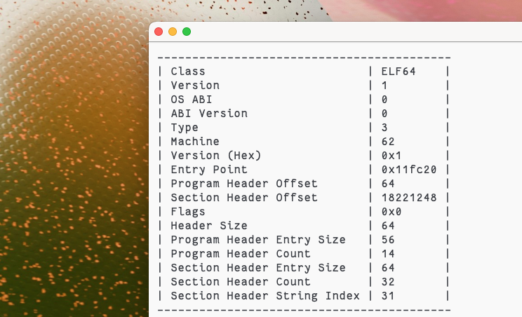

# Elf-Table
A super simple elf header viewer. This project is a little bit rushed, so do not expect clean code :(



## Usage
```
elf-table path/to/file.elf
```

## Install
```
cargo install --git https://github.com/enumouse/elf-table elf-table
```
Binaries may be available in the releases tab

## Build
```
git clone https://github.com/enumouse/elf-table
cd elf-table
cargo build --release
```

## Contributing
This project is absolutely tiny and basic. If you want to add features, you may be better of starting a new project, with or without this as a base, instead of adding it here. This was created in a handful of minutes purely as a 'I want this and idk if it exists' project and nothing more.

Regardless, I will accept basic pull requests, but please keep the above in mind.
